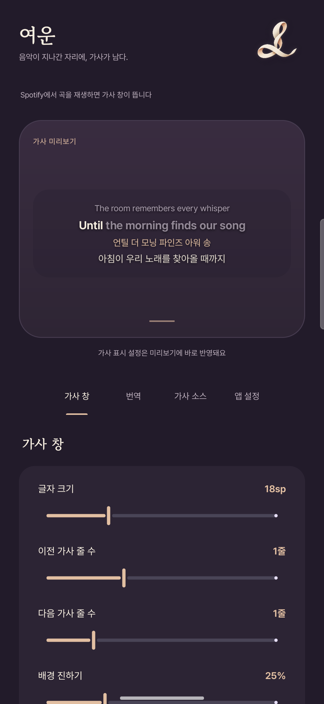

<p align="center">
  
</p>

<h1 align="center">여운 · Yeoun</h1>
<p align="center"><strong>음악이 지나간 자리에, 가사가 남다.</strong></p>
<p align="center"><a href="README.md">English</a> · 한국어</p>

여운은 Spotify에서 재생 중인 곡의 가사를 다른 앱 위에 띄우는 Android 동반 앱입니다. Spotify를 수정하지 않고 원문 가사, 번역, 발음을 함께 볼 수 있습니다.

음악이 끝난 뒤에도 마음에 남는 한 구절을 떠올리며 이름을 지었습니다. 따뜻한 아이보리색 리본과 자주색 화면, 부드럽게 이어지는 가사 전환에 그 분위기를 담았습니다.

<p align="center">
  
</p>

## 주요 기능

- **음악에 맞춰 흐르는 가사:** 위치를 옮길 수 있는 오버레이에 동기화 가사를 표시합니다. 화면에 남는 줄은 사라지지 않고 다음 위치로 이어서 이동합니다.
- **전체 화면:** 오버레이를 누르거나 **가사 소스 → 지금 재생 중 → 전체 화면 열기**를 선택하면 큰 가사 화면, 앨범 이미지 배경과 재생 조작 버튼을 사용할 수 있습니다.
- **영상 배경과 곡 정보:** 곡별 YouTube 주소나 본인의 YouTube Data API 키로 무음 영상 배경을 사용할 수 있습니다. 설정한 AI 서비스로 곡 설명을 만들고 캐시할 수 있으며, 설명은 별도 검증을 거친 연구 자료가 아닌 모델 생성 결과입니다.
- **노래방 강조:** 출처에서 제공하는 타이밍에 맞춰 단어나 글자를 강조합니다.
- **번역과 발음:** 대상 언어, 번역 스타일, 추가 지침을 지정할 수 있습니다. 발음은 대상 언어의 문자, 로마자 또는 IPA로 표시할 수 있습니다.
- **나에게 맞는 가사 창:** 글자 크기, 이전과 다음 줄 수, 배경 진하기, 애니메이션, 일시정지 후 숨김 시간을 조절합니다. 표시 설정은 미리보기에서 바로 확인할 수 있습니다.
- **가사 출처 선택:** LRCLIB, Lyrically, LyricsPlus와 ivLyrics 커뮤니티 타이밍을 켜거나 끌 수 있습니다. 일반 출처의 검색 우선순위와 전체 싱크 오프셋도 설정할 수 있습니다.
- **한국어와 영어 UI:** 앱 언어를 직접 선택하거나 시스템 설정을 따르게 할 수 있습니다. 설정은 자동으로 저장됩니다.

가사만 볼 때는 AI API 키가 필요하지 않습니다. 번역과 발음을 사용하려면 호환 API의 서버 주소, API 키, 모델을 직접 설정해야 합니다.

## 시작하기

### 요구 사항

- Android 8.0(API 26) 이상이 필요합니다.
- 같은 기기에 Spotify가 설치되어 있어야 합니다.
- 가사 검색과 캐시에 없는 AI 요청에는 인터넷 연결이 필요합니다.

### 빌드와 설치

Android Studio에서 프로젝트를 열고 **Android SDK Platform 36**을 설치합니다. Gradle 실행에는 **JDK 21**을 사용하고, Kotlin 도구 체인에 필요한 **JDK 17**도 준비합니다. `JAVA_HOME`을 JDK 21 설치 경로로 지정하거나 Android Studio의 Gradle JDK 설정에서 선택합니다.

저장소 루트에서 다음 명령을 실행합니다.

```bash
./gradlew testDebugUnitTest lintDebug assembleDebug
adb install -r app/build/outputs/apk/debug/app-debug.apk
```

Windows에서는 `./gradlew` 대신 `gradlew.bat`를 사용합니다. Android Studio에서 로컬 SDK 경로를 설정하거나, 명령줄 빌드에서는 `ANDROID_HOME` 또는 Git에 포함하지 않는 `local.properties`의 `sdk.dir`를 설정합니다.

위 명령은 개발과 테스트를 위한 **디버그 APK**를 만듭니다. 공개 배포용 APK는 별도의 서명 설정을 준비해 릴리스 빌드로 생성합니다.

이전 버전에서 업데이트할 수 있도록 앱 설치 식별자는 `dev.kuass.ivlyrics`를 유지합니다. 설치된 앱을 업데이트하려면 같은 서명 키가 필요합니다. 서명이 일치하면 `adb install -r`로 기존 데이터를 유지하며 설치할 수 있습니다.

### Spotify 연결

1. **여운 → 앱 설정 → 연결**을 엽니다.
2. Spotify의 미디어 세션을 읽을 수 있도록 **알림 접근**을 허용합니다.
3. 가사 창을 띄울 수 있도록 **다른 앱 위에 표시**를 허용합니다.
4. 여운에서 나와 Spotify에서 곡을 재생합니다.

여운의 설정 화면이 열려 있는 동안에는 기본적으로 오버레이가 숨겨집니다. 지금 재생 중인 곡을 조절할 때는 임시로 표시할 수 있습니다. 가사 창을 위아래로 끌면 위치를 옮길 수 있고, 옆으로 밀면 다음 곡이 시작할 때까지 닫을 수 있습니다.

### 번역과 발음 설정

**번역** 탭에서 서비스를 고르거나 `/v1`로 끝나는 서버 주소를 직접 입력한 뒤, 본인의 API 키와 모델을 설정합니다. 서버가 지원하면 모델 목록을 불러올 수 있습니다.

대상 언어를 선택하고 번역과 발음 중 필요한 항목을 켭니다. 이미 대상 언어로 되어 있다고 판단한 곡은 건너뜁니다. 생성한 결과는 기기에 캐시하며, 사용하는 API에 따라 요금이 발생할 수 있습니다.

## 가사와 타이밍

여운은 Spotify의 Android 미디어 세션에서 곡 제목, 아티스트, 앨범, 재생 시간과 위치를 읽습니다. Spotify 로그인 정보를 입력하거나 Spotify 앱을 패치할 필요가 없습니다.

| 출처 | 역할 |
| --- | --- |
| LRCLIB | 동기화 가사 또는 일반 가사를 제공합니다. |
| Lyrically | Apple Music 카탈로그를 검색하고, 제공되는 경우 타이밍이 포함된 가사를 가져옵니다. |
| LyricsPlus | 추가 가사 출처이며, 제공되는 경우 단어 타이밍을 가져옵니다. |
| ivLyrics 커뮤니티 | 원문 가사와 대조한 사용자 제작 글자 타이밍을 사용합니다. |

일반 출처는 설정한 순서대로 조회합니다. 노래방 강조를 켜면 줄 타이밍만 있는 결과에서 멈추지 않고 단어 타이밍을 더 찾습니다. 커뮤니티 데이터를 켰고 사용할 수 있는 결과가 있으면 우선 적용합니다. 대상 언어가 한국어일 때는 로마자로 표기된 한국어 가사보다 다른 출처의 원문 가사를 우선할 수 있습니다.

일반 가사는 곡 길이에 맞춰 균등하게 배치하고 `≈` 표시를 붙입니다. 이 경우 타이밍은 근사치입니다. 전체 싱크 오프셋이 양수이면 가사가 먼저 표시됩니다. LRC 파일의 `[offset:]` 값도 반영합니다.

## 권한과 데이터

| 접근 권한 또는 데이터 | 사용 방식 |
| --- | --- |
| 알림 접근 | Spotify 미디어 세션을 읽습니다. 알림 메시지 본문은 처리하지 않습니다. |
| 다른 앱 위에 표시 | 다른 앱 위에 가사 창을 그립니다. |
| 곡 정보 | 곡을 찾기 위해 활성화한 가사 및 검색 서비스에 전송합니다. 커뮤니티 조회에는 Spotify 트랙 ID 또는 Deezer에서 찾은 ISRC를 사용할 수 있습니다. |
| AI 요청 | 가사, 번역 설정, 곡 정보와 요청한 곡 설명을 사용자가 설정한 서버로 보냅니다. API 키는 해당 요청을 인증하는 데 사용합니다. |
| 영상 배경 | 자동 검색을 설정하면 본인의 키로 YouTube Data API에 곡 제목과 아티스트를 전송합니다. 내장 플레이어는 YouTube에 접속합니다. 직접 지정한 영상에는 검색용 API 키가 필요하지 않습니다. |
| 기기 내 저장 | 설정과 API 키는 앱 전용 SharedPreferences에, AI 결과, 생성한 곡 설명과 커뮤니티 데이터는 앱 캐시에 저장합니다. API 키를 별도로 암호화하는 계층은 없습니다. |

현재 커뮤니티 연동은 ivLyrics 타이밍 서버에 Spotify 웹 플레이어의 `Origin` 헤더를 전송합니다. **가사 소스** 탭에서 커뮤니티 데이터를 끌 수 있습니다. 외부 API의 응답과 이용 가능 여부는 각 서비스에 따라 달라집니다.

번역 탭의 **저장된 결과 지우기**는 캐시한 AI 결과를 삭제합니다. API 키, 설정, 커뮤니티 캐시와 생성한 곡 설명은 삭제하지 않습니다. 공개 이슈에 API 키, 비공개 서버 주소나 민감한 정보가 담긴 로그를 첨부하지 마세요.

## 현재 지원 범위

- Android의 Spotify 재생을 지원합니다.
- 가사 제공 범위, 곡 매칭과 단어 타이밍은 출처에 따라 다릅니다. AI 번역과 발음에는 오류가 있을 수 있습니다.
- 타이밍 편집기는 포함하지 않습니다.
- **가사 소스 → 지금 재생 중**에서 현재 곡의 오프셋과 번역 언어를 지정할 수 있습니다. 곡별 오프셋은 전체 오프셋에 더해집니다. 이곳에서 가사 창을 임시로 표시하면 실제 창을 보면서 조절할 수 있습니다.
- 실기기에서는 연결한 휴대폰 한 대의 설정 화면과 샘플 가사 애니메이션을 확인했습니다. 단위 테스트가 외부 API의 실시간 상태나 모든 Android 기기의 동작을 검증하는 것은 아닙니다.

## 개발과 기여

Kotlin, Android Views/XML과 Material Components로 구현했습니다.

```text
SpotifyListener → LyricsSources / CommunitySync → LyricsOverlay → LyricsView
              └→ Ai / LyricsCache ────────────────────────┘
MainActivity → Prefs → 설정 및 공통 미리보기 렌더러
```

소스는 [`app/src/main/kotlin/dev/kuass/ivlyrics`](app/src/main/kotlin/dev/kuass/ivlyrics), 리소스는 [`app/src/main/res`](app/src/main/res), 단위 테스트는 [`app/src/test/kotlin/dev/kuass/ivlyrics`](app/src/test/kotlin/dev/kuass/ivlyrics)에 있습니다.

미리보기에는 실제 발매곡에서 가져온 가사 대신 여운을 위해 직접 작성한 샘플 문장을 사용합니다.

[Quality 워크플로](.github/workflows/quality.yml)는 Git에 등록한 소스로 빌드와 단위 테스트, lint를 실행하고 Gradle 래퍼와 비밀정보를 검사합니다. Gitleaks는 버전과 체크섬을 고정해 로컬에서 실행합니다. 변경 사항을 스테이징한 뒤 같은 검사를 실행할 수 있습니다.

```bash
python3 scripts/install-gitleaks.py
python3 scripts/check-publication.py --build
```

별도 폴더에서 빌드하므로 `ANDROID_HOME`을 SDK 경로로 설정해 주세요. 검사 결과와 검증한 디버그 APK는 `build/publication/`에 저장합니다. 자세한 검증 범위는 [공개 절차](docs/PUBLISHING.md)에 정리했습니다.

문제를 제보할 때는 Android 버전, 기기 모델, 앱 버전과 재현 순서를 적어 주세요. 가사 문제라면 활성화한 출처도 알려 주세요. 한국어와 영어 모두 환영합니다. 코드를 변경할 때는 바뀌는 동작을 설명하고 위의 빌드 명령을 실행해 주세요. UI 변경에는 스크린샷을, 애니메이션 변경에는 짧은 녹화 영상을 함께 남겨 주세요.

## 출처와 라이선스

여운의 번역과 발음 기능은 [ivLyrics](https://github.com/ivLis-Studio/ivLyrics)의 작업을 바탕으로 합니다. 커뮤니티 타이밍은 ivLyrics 사용자들이 제공하며, UI에는 [Pretendard](https://github.com/orioncactus/pretendard)와 [고운바탕](https://github.com/yangheeryu/Gowun-Batang)을 사용합니다.

여운에서 새로 작성한 소스 코드에는 **GNU Lesser General Public License v2.1 only(LGPL-2.1-only)**를 적용합니다. 전문은 [LICENSE](LICENSE)에서 확인할 수 있습니다. 원본에서 가져온 코드의 고지는 보존하며, 포함된 글꼴에는 SIL Open Font License를 유지합니다. 자세한 출처와 라이선스 원문은 [제삼자 고지](THIRD_PARTY_NOTICES.md)에 정리했습니다. 가사와 외부 서비스에는 각각의 권리와 이용 조건이 적용됩니다.

여운은 독립적인 동반 앱이며 Spotify나 Apple의 공식 앱 또는 제휴 앱이 아닙니다.
