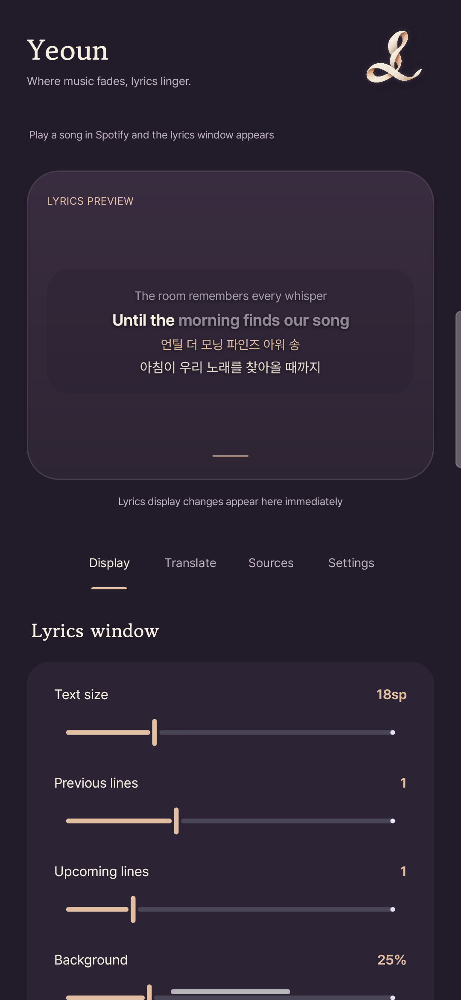

<p align="center">
  
</p>

<h1 align="center">Yeoun · 여운</h1>
<p align="center"><strong>Where music fades, lyrics linger.</strong></p>
<p align="center">English · <a href="README.ko.md">한국어</a></p>

Yeoun is an Android companion for Spotify that puts synchronized lyrics above your other apps. Follow the original words, read a translation, or sing along with pronunciation guides, without modifying Spotify.

*Yeoun* (여운) is a Korean word for the feeling that lingers after a sound or an experience. The warm ivory ribbon, plum surfaces, and flowing lyric transitions follow that idea.

<p align="center">
  
</p>

## What you can do

- **Follow the music.** Display synchronized lyrics in a movable overlay. Shared lines move into place instead of disappearing between transitions.
- **Open fullscreen.** Tap the overlay or use **Sources → Now playing → Open fullscreen** for a larger lyrics view, album-art background, and playback controls.
- **Optional video and song notes.** Use a per-track YouTube URL or your own YouTube Data API key for a muted video background. Generate cached song notes with your configured AI provider; these are model-generated explanations, not independently verified research.
- **Time your own lyrics.** Open **Make sync** from Sources or fullscreen, use the existing lyrics or paste your own, and tap each line start during playback. Save timed lines as local LRC; untimed lines are omitted. Deleting local timing restores online lookup.
- **Sing along.** Highlight words or characters when the selected source provides timing data.
- **Understand another language.** Add AI translations and pronunciation guides. Choose a target language, translation style, extra instructions, and native-script, romanized, or IPA pronunciation.
- **Make the window yours.** Adjust text size, surrounding lines, background opacity, animation, and the delay before hiding paused lyrics. Check display changes in the live preview.
- **Choose your sources.** Enable LRCLIB, Lyrically, LyricsPlus, and ivLyrics community timing data. Choose which regular source to try first and adjust a global synchronization offset.
- **Use either interface language.** Switch between Korean, English, and the system language. Settings save automatically.

Lyrics work without an AI API key. Translation and pronunciation require your own compatible API endpoint, key, and model.

## Get started

### Requirements

- Android 8.0 (API 26) or later.
- Spotify installed on the same device.
- An internet connection for lyrics lookup and uncached AI requests.

### Build and install

Open the project in Android Studio and install **Android SDK Platform 36**. Use **JDK 21** to run Gradle and make **JDK 17** available for the configured Kotlin toolchain. Set `JAVA_HOME` to your JDK 21 installation, or select it as the Gradle JDK in Android Studio.

From the repository root:

```bash
./gradlew testDebugUnitTest lintDebug assembleDebug
adb install -r app/build/outputs/apk/debug/app-debug.apk
```

On Windows, use `gradlew.bat` in place of `./gradlew`. Android Studio can configure the local SDK path; command-line builds can use `ANDROID_HOME` or an untracked `local.properties` file with `sdk.dir`.

This produces a **debug APK** for development and testing. For a public release, build and sign a release APK with your own signing configuration.

The application ID remains `dev.kuass.ivlyrics` to preserve upgrades from earlier builds. Updating an installed app requires the same signing key; `adb install -r` preserves its data when the signatures match.

### Connect Spotify

1. Open **Yeoun → Settings → Connection**.
2. Grant **Notification access** so Yeoun can read Spotify's media session.
3. Grant **Display over other apps** so it can show the lyrics window.
4. Leave Yeoun and play a song in Spotify.

The overlay is normally hidden while Yeoun's settings screen is open; the Now playing section can temporarily show it while you adjust a track. Drag it vertically to reposition it. Swipe it sideways to dismiss it until the next track.

### Optional translation and pronunciation

Open **Translate**, choose a service or enter a custom server address ending in `/v1`, and enter your own API key and model. You can load the model list if the endpoint supports it.

Choose a target language and enable translation, pronunciation, or both. Songs detected as already being in the target language are skipped. Results are cached on the device. Provider usage charges may apply.

## Lyrics and timing

Yeoun reads the track title, artist, album, duration, and playback position from Spotify's Android media session. It does not need Spotify credentials or a patched Spotify client.

| Source | Role |
| --- | --- |
| LRCLIB | Synchronized or plain lyrics |
| Lyrically | Apple Music catalog lookup and lyrics with timing when available |
| LyricsPlus | Another lyrics source, including word timing when available |
| ivLyrics community | Community-authored character timing matched to its original lyrics |

Enabled regular sources run in the chosen order. With karaoke enabled, Yeoun continues looking for word timing when a result only has line timing. Locally saved lyrics take priority over every online source. Otherwise, usable community timing takes priority when enabled. For Korean targets, romanized Korean results can yield to original-script lyrics from another source.

Plain lyrics are distributed across the track duration and marked with `≈`; this is approximate timing. A positive global offset displays lyrics earlier. LRC `[offset:]` metadata is also supported.

## Permissions and data

| Access or data | How it is used |
| --- | --- |
| Notification access | Reads Spotify's media session. The app does not process notification message bodies. |
| Overlay permission | Draws lyrics above other apps. |
| Track metadata | Sent to enabled lyrics/search services to find the matching track. Community lookup can use a Spotify track ID or an ISRC resolved through Deezer. |
| AI requests | Lyrics, translation preferences, song context, and requested song notes are sent to the endpoint you configure. Your key authenticates those requests. |
| Video background | With automatic matching configured, track title and artist are sent to YouTube Data API using your key. The embedded player connects to YouTube. A manually selected video does not need a search API key. |
| Local storage | Settings, locally timed lyrics, and API keys use app-private SharedPreferences; AI results, generated song notes, and community data use app cache storage. Keys do not have a separate encryption layer. |

The current community integration sends the Spotify web-player `Origin` header to the ivLyrics timing endpoint. You can disable community data in **Sources**. API availability and responses depend on the external services.

Use **Clear cached results** in Translate to remove cached AI results. This does not remove your API key, settings, community cache, or generated song notes. Do not attach API keys, private endpoint addresses, or unredacted logs to public reports.

## Current scope

- Spotify on Android is the supported playback source.
- Lyrics coverage, matching, and word timing depend on the providers. AI output can be inaccurate.
- The timing editor records line starts on this device. It does not author word/character timing or upload community sync data.
- In **Sources → Now playing**, set an offset and translation language for the current track. The track offset is added to the global offset. Enable the temporary overlay preview there to adjust while watching the actual window.
- Device verification has covered the settings UI and sample lyric animation on one connected phone. Unit tests do not verify live provider availability or every Android device.

## Development

The app uses Kotlin, Android Views/XML, and Material Components.

```text
SpotifyListener → LyricsSources / CommunitySync → LyricsOverlay → LyricsView
              └→ Ai / LyricsCache ────────────────────────┘
MainActivity → Prefs → settings and shared preview renderer
```

Source lives in [`app/src/main/kotlin/dev/kuass/ivlyrics`](app/src/main/kotlin/dev/kuass/ivlyrics), resources in [`app/src/main/res`](app/src/main/res), and unit tests in [`app/src/test/kotlin/dev/kuass/ivlyrics`](app/src/test/kotlin/dev/kuass/ivlyrics).

The preview uses original demonstration text written for Yeoun, not lyrics copied from a released song.

The [Quality workflow](.github/workflows/quality.yml) builds the indexed source, runs unit tests and lint, validates the Gradle wrapper, and scans for secrets locally with a pinned Gitleaks binary. To run the same publication check locally after staging your changes:

```bash
python3 scripts/install-gitleaks.py
python3 scripts/check-publication.py --build
```

Keep `ANDROID_HOME` set to the SDK location for the isolated build. Results and the tested debug APK are written to `build/publication/`. See [publication instructions](docs/PUBLISHING.md) for the exact verification scope.

For a bug report, include the Android version, device model, app version, reproduction steps, and the enabled lyrics source when relevant. Korean and English reports are welcome. For code changes, explain the behavior and run the build command above. Include screenshots for UI changes and a short recording for animation changes.

## Credits and license

Yeoun builds on translation and pronunciation work from [ivLyrics](https://github.com/ivLis-Studio/ivLyrics). Community timing is provided by ivLyrics contributors. The interface uses [Pretendard](https://github.com/orioncactus/pretendard) and [Gowun Batang](https://github.com/yangheeryu/Gowun-Batang).

Yeoun's original source code is licensed under the **GNU Lesser General Public License v2.1 only (LGPL-2.1-only)**. See [LICENSE](LICENSE). Upstream-derived code retains its applicable notices; bundled fonts keep their SIL Open Font License. See [third-party notices](THIRD_PARTY_NOTICES.md) for attribution and the preserved license texts. Lyrics and third-party services retain their respective rights and terms.

Yeoun is an independent companion app and is not affiliated with or endorsed by Spotify or Apple.
